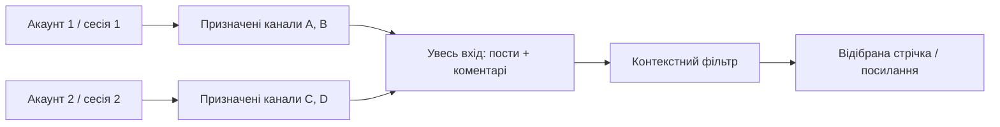

# Ролі, Sources і кілька Telegram-акаунтів

## Де дивитися

- `/sources` — каталог модулів із перемикачами й переходами до налаштувань. Реалізовано Telegram; RSS явно недоступний.
- `/sources/telegram?tab=accounts` — акаунти та стан підключення; `/sources/telegram?tab=channels` — явний список каналів і призначення акаунта.
- `/inbox` — **усі зібрані** пости й коментарі з усіх workflow, включно з pending/review/rejected та позначками видалення. Текст уже нормалізований і контакти замасковані. Це не дамп усіх чатів акаунта.
- `/` — відібрана стрічка. Оператори можуть змінювати фільтр рішення; viewer бачить тільки accepted.

Увесь вхід оновлюється кожні 5 с, має пошук, фільтри workflow/каналу/типу/стану, пагінацію, повний текст і прямий батьківський контекст. Тексти можуть бути доступні до завершення processor. «Остання обробка» для pending після редагування може стосуватися попередньої версії; pending явно вказує, що актуальна версія ще очікує обробки.

## Поточні права

| Роль | Доступні дії |
| --- | --- |
| viewer | Відібрана стрічка, фільтри, дозволений контекст і оригінальні джерела |
| analyst | Те саме + увесь вхід, матеріали на перевірці, відсіяне, черга обробки |
| admin | Те саме + користувачі, Sources, credentials, workflow, ручні рішення accepted/review/rejected, створення й відкликання посилань |

Резерв прав на майбутні інциденти у `packages/shared` не означає реалізоване редагування інцидентів. Налаштування джерел і зміна credentials не доступні analyst/viewer. Секрети сесій API не повертає навіть admin.

## Що означає посилання

Це доступ до обраної частини результатів workflow без створення користувача. Адмін задає канали, теми, строк і деталізацію: лише зведення, пости або пости з коментарями. За посиланням видно тільки accepted. Увесь вхід, відсіяне, pending, credentials і керування недоступні.

Це не копія даних і не новий збирач: нові результати того самого workflow також з'являються в межах заданого доступу. Особа з посиланням може передати його іншій; тому є строк дії та відкликання. Відкликання припиняє також уже відкритий доступ при наступному запиті.

## Два акаунти: механіка

Один collector запускає окремий `TelegramClient` для кожної авторизованої ввімкненої сесії. У сесій окремі підключення, помилки й FloodWait; дані зводяться в PostgreSQL. Один доданий канал призначений одній сесії, тому дві однакові підписки не запускають подвійний збір. Зміна призначення — явна адмінська дія, не автоматичний обхід лімітів.

Сесія містить авторизацію Telegram-акаунта; це не роль користувача сайту і не Bot API token. API ID/hash ідентифікують клієнтський застосунок. Для різних акаунтів потрібні різні авторизовані сесії; один і той самий session key не запускати одночасно в сторонній програмі. [Документація Telethon про сесії](https://docs.telethon.dev/en/stable/concepts/sessions.html).

Для підключення двох акаунтів підготовлено два записи конфігурації. Порожній запис має статус `setup_required` / «Очікує авторизації». Сесія без API ID/hash має `api_credentials_required` і залишається вимкненою; API-доступ можна доповнити на сайті без нового коду Telegram. Кнопка підготовки ідемпотентна: повторне натискання не додає третій/четвертий акаунт. Після імпорту валідної StringSession можна ввімкнути акаунт; фактичну авторизацію перевіряє collector.

Поточний спосіб авторизації — на сервері від root виконати `.venv/bin/python scripts/create_session.py --account 1` та `--account 2` для другого акаунта. Скрипт автоматично зберігає сесію й API-доступ у системі; імпорт у картку вручну не потрібен. Код Telegram і 2FA вводяться локально інтерактивно, не в чат. Підключення за номером/QR безпосередньо в браузері ще не реалізоване. API ID/hash отримуються через [my.telegram.org](https://my.telegram.org), процедура описана в [Telegram API](https://core.telegram.org/api/obtaining_api_id).

## Як вибираються канали

Адмін додає `@username`, підставу використання, workflow та акаунт з доступом. Підписки акаунта відображаються як довідник після підключення; самі по собі вони не дозволяють збір усіх каналів. Акаунти не приєднуються до каналів/груп автоматично.

Нейронка не шукає нові джерела і не обходить акаунти. У майбутньому пошук за назвами/описами може пропонувати кандидатів, які адмін явно затвердить. Для першого тесту достатньо вручну додати власні публічні канали. Ключове слово в назві каналу не замінює тематичний текст поста; rules-v1 фільтрує повідомлення і контекст відповідей.

Для перевірки створити власний публічний тестовий канал з @username, прив'язати discussion group та підписати призначений акаунт на потрібні джерела. Додати пост «Тест: Vodafone — перевірка інтернету», короткий коментар «У мене теж», окремий нетематичний пост та явно тестовий спам. Увесь вхід покаже зібране, відібрана стрічка — тільки accepted. У каналі без дописів система чесно показуватиме нуль матеріалів. Позначайте ці матеріали як тестові; вони не доводять якість на реальному інфопросторі.

Telethon працює з API й має обмеження запитів та доступу до обговорень. При FloodWait зберігається пауза конкретного акаунта; інший продовжує власні призначені канали. [Параметри Telethon](https://docs.telethon.dev/en/stable/modules/client.html). Правові й практичні межі — в [TELEGRAM.md](TELEGRAM.md).
