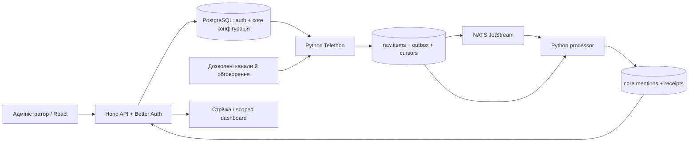

# Реалізована архітектура

## Рішення та відповідальність

За прямим дорученням користувача збережено каркас Claude. TypeScript відповідає за сайт, Better Auth, конфігурацію, дозволи й читання готових результатів. Python потрібен для Telethon та автономної обробки. PostgreSQL — джерело істини; NATS JetStream переносить події між процесами. Заміна вже готової авторизації на Go/Rust не допомагає поточному демо.

Сайт не викликає збирач чи processor через HTTP. Збирач перечитує конфігурацію кожні 2 с. Налаштування polling не є гарантією затримки доставки Telegram. Вимкнення збору залишає вже збережені матеріали доступними, processor завершує їх обробку.

| Компонент | Вхід → вихід |
| --- | --- |
| `apps/api` | HTTP + Better Auth session → конфігурація, ролі, доступ до готової стрічки |
| `apps/web` | React, TanStack Query → вхід, стрічка, користувачі, адмін Telegram, спільний dashboard |
| `apps/web/src/pages/telegram` | React-сторінки керування Telegram (сесії, канали, workflow, доступи, стан); ті самі `/api/admin/*` й Better Auth. Окремої iframe-консолі більше немає |
| `packages/shared` | Спільне визначення ролей і прав |
| `services/pipeline/telegram.py` | Конфігурація + MTProto → нормалізовані матеріали, стан сесій, курсори, outbox |
| `services/pipeline/processor.py` | Події або незавершені записи → рішення фільтра, контекст, збіги тексту, receipts |
| `packages/contracts/events` | JSON Schema події `raw.item.created`, версія 1 |

## Власники даних

| Таблиці | Хто пише; значення |
| --- | --- |
| `auth.user/session/account/verification/rateLimit` | Better Auth через API; дані користувачів сайту, не авторів Telegram |
| `auth.share_links/share_sessions` | API; SHA-256 токенів, scope, expiry, revocation |
| `core.modules/workflows/telegram_accounts/sources` | API; бажана конфігурація, AES-256-GCM секрети сесій |
| `raw.account_status/memberships/source_state/threads/service_status` | collector; фактичні стани й позиції збору |
| `raw.items/outbox` | collector; мінімальний нормалізований текст, походження, подія в одній транзакції |
| `core.mentions/processing_receipts/service_status` | processor; один результат на raw item, стан обробки його версії |
| `core.review_decisions/audit` | API; ручна перевірка конкретної версії матеріалу та дії адміністратора |

На сервері це окремі PostgreSQL login-ролі `ufv_api`, `ufv_collector`, `ufv_processor`, встановлені `deploy/bootstrap.py`. API не має прямих прав на `raw.items`: для операторського `/inbox` читає вузьке представлення `core.incoming_items`, яке показує нормалізований вхід разом зі станом актуальної обробки. API не пише спостережені стани; collector не пише результати; processor не змінює raw. Власник міграцій `ufv` не використовується застосунками. Локальний dev за замовчуванням спрощений і працює власником БД.

Початкові таблиці інцидентів з каркаса можуть існувати, але робочих функцій інцидентів ще немає. Старе `raw.items.processed_at` не використовується: актуальний механізм — `core.processing_receipts`. Не створювати другу авторизацію або SQLite-сховище поруч.

## Контракти

Матеріал: `source_id`, `source_item_id = peer_id:message_id`, `kind = post|comment`, `thread_item_id` (ключ поста), `parent_item_id` (ключ прямого батька), `url`, `published_at`, `fetched_at`, `edited_at`, `text`, `content_hash`, `version`, `deleted`. Для коментаря кореневе повідомлення discussion group зіставляється з постом каналу. Ідентифікатори peer тут позначають канали/обговорення, не авторів.

Подія після commit: `{v:1, raw_item_id:"123", source_id:"7", source_kind:"telegram", fetched_at:"ISO-8601"}`. Повний текст і секрети не передаються через NATS. Версія матеріалу входить до `Nats-Msg-Id`; споживач завжди читає актуальний raw запис. Неочікувана версія події відхиляється. Зміни схеми події погоджувати з обома процесами.

Результат фільтра: `decision = accepted|review|rejected`, пояснення `reason`, `category`, `brand`, `context_id`, `duplicate_of`, цитата `quote`, `raw_version`, `analyzed_at`. `quote` береться безпосередньо зі збереженого нормалізованого тексту, не генерується. Після маскування контактів він може відрізнятися від Telegram-оригіналу. Значення sentiment, severity із початкової схеми не є виміряним AI-результатом і не використовуються для оцінки кризи.

Основні маршрути:

| Маршрути | Доступ |
| --- | --- |
| `/api/auth/*`, `/api/me` | Better Auth, закритий signup |
| `GET /api/feed`, `/api/documents/:id`, `/api/workflows` | Вхід; viewer бачить лише accepted |
| `GET /api/inbox`, `/api/inbox/:id` | admin/analyst; весь зібраний вхід, включно з pending/rejected; без доступу за share |
| `/api/admin/state`, `/module`, `/workflows`, `/accounts`, `/channels`, `/shares`, `/documents/:id/review` | admin; усе перевіряє сервер |
| `/api/shared/redeem` | Обмін токена посилання на HttpOnly-cookie |
| `/api/shared/me`, `/feed`, `/documents/:id` | Перевірка scope/expiry/revocation на кожному запиті |
| `/api/health` | Перевірка API та доступу до PostgreSQL, не health Telegram |

Адмін може змінювати credentials, активність модуля/workflow/сесії/каналу та повторно запускати фільтр. Analyst бачить матеріали на перевірці й відсіяне; редагування інцидентів зарезервоване в ролях, але поки не реалізоване. Ручне рішення й керування посиланнями в поточному UI доступні admin.

## Надійність і межі

- Унікальність `(source_id, source_item_id)`; незмінний матеріал не створює нової outbox-події. Зміна тексту збільшує `version`.
- Історичний курсор зсувається тільки після запису. Live-повідомлення його не пересувають, тому пропущену історію можна добрати після рестарту.
- Кожне обговорення має окремий `comment_cursor`. Polling проходить обговорення по черзі, не лише останні пости.
- Outbox публікується після збереження, відмічається після ack. Повторні доставки безпечні завдяки upsert і advisory lock на матеріал.
- Processor звіряє версію матеріалу та ревізію workflow з receipt. Добирання з БД працює й при недоступному NATS. Ручний reprocess підвищує ревізію workflow.
- Пізні батьківські повідомлення підхоплюються повторно; редагування контексту інвалідує аналіз дочірніх відповідей.
- Повторення тексту довгих постів позначається `duplicate_of`. Це не визначення всіх перепублікацій і не доказ незалежності інших текстів.
- При спостереженому видаленні поста очищаються його текст і коментарі. Повноту видалень за час офлайн не гарантовано.
- Один активний collector захищений PostgreSQL advisory lock. Багаторепліковий збір не реалізований.
- Сесії зашифровані AES-256-GCM, однаковий 32-байтовий `TG_SESSION_KEY` потрібен API й collector; у відповідях ключів немає. Серверні backup теж потребують захисту.
- Посилання містить 256-бітний секрет у fragment, який не надсилається при HTTP GET. Після POST-обміну fragment прибирається з адреси. Summary не дозволяє читати чи шукати текст; posts не дозволяє коментарі; контекст перевіряється тим самим scope.

Міграція `0004_sources_inbox.sql`: поля credentials акаунта допускають узгоджений порожній набір лише для вимкненого підготовленого запису. Collector такі записи пропускає. `POST /api/admin/accounts/prepare` готує мінімум два місця під advisory lock і не генерує авторизацію Telegram.
