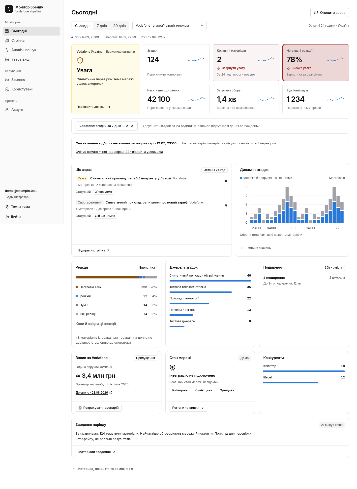

# Ранкова передача · 20 вересня 2026

**Чернетка після повного релізу, 01:22 Київ.** Остаточне приймання й два кола огляду ще тривають. Підтверджений стан deployment — у [STATUS](STATUS.md); не видавати підготовлений код за розгорнутий.

## Що вже видно на сайті

На [hire.qpon](https://hire.qpon) працюють тематичний dashboard/feed із завершеною разовою Gemini-розміткою, явний перехід до Vodafone за 7 днів, окремі негативні/іронічні/сумні реакції та межі покриття. API/UI-реліз 21:53 UTC додав ізоляцію кешу між сеансами й прив'язку спільного доступу до конкретного посилання. Відкрита стара вкладка потребує перезавантаження.

Нічний пакет **розгорнуто о01:19 Київ**: позачерговий збір зі станами черги, демо мережі, сценарний калькулятор, окремий analyst без ключа, S1/S2 та фізичні місячні агрегати. Analyst має свіжий heartbeat і `waiting_key`. Контрольні прийняті матеріали: 24h — **0**, 7d — **33**, 30d — **34**, Vodafone за7днів — **2**; переходи до джерел і доказів збігаються. Повний візуальний огляд і кола полірування ще тривають.

## Ілюстрації інтерфейсу

Усі знімки в цьому документі зроблено на **синтетичних даних у локальному браузері**. Числа, назви проблем і реакції ілюструють вигляд; вони не є результатами вимірювання production. Персональні дані й реальні тексти повідомлень у знімки не включено.



[Темна тема](img/night-dashboard-synthetic-dark.png) · [Демо мережі на телефоні](img/night-network-demo-mobile.png) · [Сценарний калькулятор на телефоні](img/night-impact-scenario-mobile.png).

## Перевірки та відкат

- 133 backend-тести злитого дерева пройдено на окремій `ufv_checks`; реальних Telegram/LLM викликів у них немає.
- Перевірено ролі, human/context invalidation, атомарний місяць, legacy RSS scope, refresh/backoff, analyst mocks і нові/наявні grants.
- Синтетичний Chromium: 1440/768/390, дві теми; переходи до доказів, калькулятор і демо мережі. Окремий acceptance із реальною тестовою БД — 320/390/768/1440, дві теми.
- Після повного релізу мають бути записані live-числа, строки відповіді, статус analyst та повний огляд усіх екранів.

Розгорнуті images: `ufv-api:night-20260919T221752Z`, `ufv-pipeline:night-20260919T221752Z`, `ufv-analyst:night-20260919T221752Z`. Manifest має `verified`; git `6ba09d9`. Єдиний нічний restart collectors використано.

```bash
deploy/night-release.sh --rollback /var/lib/ufv/releases/night-20260919T221752Z.json
```

Команда повертає перевірений bridge API й попередні workers, видаляє вперше доданий analyst. Адитивна схема зберігається. Старі manifests до цього повного релізу не застосовувати для відкату: вони повертають API без потрібної перевірки повноти місяця.

## Межі для презентації

Ключ постійного LLM не додавався. Telegram `llm_allowed` не вмикався. Завершений разовий аналіз і майбутній безперервний consumer — різні режими. Прогалини після cutoff залишаються видимими; настрої відібраних коментарів не представляють усіх абонентів.

Мережа — позначене демо; Threads/X не підключені; калькулятор показує припущення, а не збитки. Автоматичні інциденти, прогнозування кризи, перевірена точність і чат на живих даних не заявляються готовими. Картка конкурентів веде до прийнятих матеріалів; окрему сторінку конкурентів поки не створено.

## Порядок показу журі

1. **Тематичний відбір і докази:** «Сьогодні» → Vodafone за 7 днів → матеріал → цитата й оригінал. Нуль за добу пояснюється часом публікації, а не доведеною відсутністю проблем.
2. **Реакції й покриття:** частка негативних emoji, окремі іронія/сум, час вимірювань і pending-вхід. Пороги уваги — налаштування демо.
3. **Слоти й сценарій впливу:** демо регіон → вишка та калькулятор сценарію з джерелом і формулою.

Краще не відкривати першим **«Увесь вхід»**: це операторський масив до відбору, він містить сторонні теми. Для першого враження використовувати тематичну стрічку.

Контракти й відповіді для команди: [TEAM_BRIEF](TEAM_BRIEF.md), [CURATED_DASHBOARD](CURATED_DASHBOARD.md), [ANALYST](ANALYST.md), [NIGHT_I6_REVIEW](NIGHT_I6_REVIEW.md).
