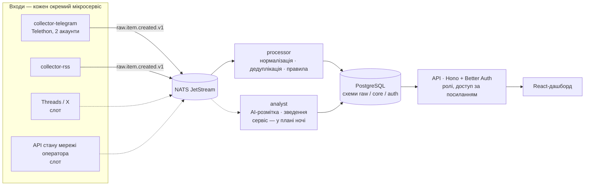

# Бриф для команди: на чому будувати пітч

Стан на **19.09.2026, 23:00 (Київ)**. Уночі код змінюється — перед фінальними слайдами звіртеся з [STATUS.md](STATUS.md). Базова точка для презентації — тег `pitch-base-2026-09-19`. План ночі — [PLAN_NIGHT.md](PLAN_NIGHT.md).

## 1. Що це, одним абзацом

**Vodafone: AI Reputation & Crisis Intelligence** — платформа раннього виявлення репутаційних сигналів для комунікаційної команди оператора. Вона безперервно збирає відкриті матеріали (Telegram-канали з коментарями, новинні RSS), нормалізує їх, прибирає дублікати й шум, зв'язує згадку з контекстом і дослівною цитатою та показує, що відбувається з брендом зараз, — щоб PR-менеджер побачив проблему раніше, ніж вона стане кризою, і міг перевірити докази перед тим, як діяти.

## 2. Що показувати

| Адреса | Що це | Примітка |
|---|---|---|
| **https://hire.qpon** | робочий застосунок на живих даних (потрібен вхід — доступ видає адміністратор) | **Увесь вхід** — живий потік, оновлюється кожні 5 с; **Стрічка** — пройшло фільтр; **Sources** — керування збирачами |
| https://hire.qpon/analysis | AI-розмітка з перевіреними цитатами + добірка вебматеріалів | для admin/analyst |
| **https://hire.qpon/showcase** | продуктове бачення: дашборд, вплив на бізнес, конкуренти, аналітик | без входу; статичний знімок, демо-записи позначені |

Найсильніший хід демо: спершу showcase («ось продукт»), потім робочий застосунок («ось двигун під ним, і він уже крутиться на реальних даних»).

### Сценарій демо на 3 хвилини

1. **0:00 — showcase.** «Ось що бачить PR-менеджер уранці»: статус, найкритичніша ситуація як *проблема*, рекомендовані дії.
2. **0:40 — гроші.** Калькулятор: година збою на 10% абонентів — порядок втрат. «Репутація — це виручка».
3. **1:10 — робочий застосунок, «Увесь вхід».** Потік оновлюється на очах: це не макет.
4. **1:40 — один матеріал.** Відкрити: цитата, контекст, посилання на оригінал, причина рішення. «Кожен висновок можна перевірити».
5. **2:10 — Sources.** Telegram і RSS увімкнені, Threads і стан мережі — слоти. «Нове джерело — новий контейнер».
6. **2:40 — що потрібно від Vodafone** і наступний крок.

## 3. Головна теза: працює архітектура, яку можна масштабувати

Суцільні лінії — працює зараз, пунктир — слот або план. Що з цього випливає і що варто проговорити:

- **Нове джерело = новий контейнер.** Усі збирачі говорять одним контрактом події `raw.item.created.v1`. Підключили Threads чи внутрішній API оператора — processor, база, API й інтерфейс не змінюються. Це не обіцянка: RSS-збирач додали саме так за кілька годин, поруч із працюючим Telegram.
- **Сервіси незалежні.** Збирачі, обробник і сайт — окремі процеси з окремими ролями в базі й окремими мережами. Обробник узагалі не має виходу в інтернет; ключі Telegram зашифровані (AES-256-GCM) і ніколи не потрапляють у браузер. Падіння одного сервісу не зупиняє інші, черга зберігає події.
- **AI — шар, а не моноліт.** Розмітку вже виконано моделлю (Gemini) окремим запуском поверх тієї самої бази: результати моделі зберігаються окремо від правил і рішень людини. Кожна відповідь перевіряється — цитата-доказ мусить дослівно бути у вихідному тексті, інакше відповідь відкидається; тексти з мережі передаються як недовірені дані. Наступний крок (у плані ночі) — той самий контракт як постійний сервіс за єдиним інтерфейсом провайдера, щоб модель можна було замінити без змін у решті системи.
- **AI для самого збирача (закладено в план):** модель бачить, що проходить фільтр, а що відсіюється, і пропонує адміністратору нові ключові слова та джерела. Рішення лишається за людиною. Говорити як про напрям, не як про готову функцію.
- **«Стеження за постом»** вже реалізоване для Telegram: система помічає активний пост, закріплюється за ним і знімає перегляди, реакції та коментарі, доки він не згасне (2–24 дні). Та сама модель переноситься на Threads/X.
- **Права — частина архітектури.** Кожне джерело має зафіксовану підставу використання; 5 із 13 новинних стрічок свідомо вимкнені, бо умови видавців не дозволяють збір; у модель ідуть лише матеріали з дозволених джерел. Для корпоративного клієнта це аргумент, а не обмеження.

## 4. Шлях одного поста: модель даних

Принцип: **спершу зберегти, потім думати.** Збирач нічого не вирішує — він лише приносить матеріал. Усі висновки робляться вже над збереженою копією і зберігаються окремо від неї, тому фільтр можна покращити й перезапустити на всій історії, нічого не втрачаючи.

1. **Збір.** Беремо все з явно доданих джерел: пости, коментарі з прив'язкою до батьківського повідомлення, повідомлення груп, анонси RSS.
2. **Нормалізація до збереження.** Текст очищується; e-mail, телефони, згадки акаунтів і посилання всередині тексту замінюються позначками на зразок «[номер вилучено]». Автори не зберігаються взагалі.
3. **Сирий запис** (`raw`): текст, **посилання на оригінал**, час публікації й час отримання (невідомий час так і лишається невідомим), відбиток тексту для пошуку дублів, версія (редагування й видалення в джерелі відстежуються), знімки метрик у часі — перегляди, пересилання, відповіді, реакції по кожному емодзі.
4. **Подія в шину** → обробник бере запис із черги.
5. **Розмітка** (`core`), окремо від сирого запису — три незалежні шари:
   - **правила** (працюють на всьому потоці): бренд, тема, рішення «у стрічку / на перевірку / відсіяти» і **пояснення людською мовою, чому саме так**;
   - **модель** (поки на дозволених новинних джерелах): релевантність, бренди, тема, **тональність**, 1–3 дослівні цитати-докази;
   - **людина**: може перекласти будь-який матеріал; її рішення має пріоритет і переживає повторну обробку.

### Паспорт розміченого матеріалу

| Поле | Приклад | Хто ставить |
|---|---|---|
| Тип | пост · коментар · повідомлення групи · RSS-анонс | збирач |
| Посилання на оригінал | `t.me/канал/1429` | збирач |
| Опубліковано / отримано / оброблено | три окремі мітки часу → з них рахується реальна затримка | збирач, обробник |
| Бренд | vodafone · kyivstar · lifecell · telecom | правила / модель |
| Тема | мобільний зв'язок · інтернет · мережа й покриття · тарифи та списання · підтримка | правила / модель |
| Рішення | у стрічці · на перевірці · відсіяне | правила → людина |
| Причина | «Коротка відповідь стосується тематичного батьківського повідомлення» | правила |
| Контекст | посилання на батьківський пост | обробник |
| Дублікат | «збіг тексту з іншим постом — не незалежне підтвердження» | обробник |
| Цитата-доказ | дослівний фрагмент тексту | правила / модель, з перевіркою |
| Тональність | позитивна · нейтральна · негативна · змішана · невідома — **щодо оператора, а не події** | лише модель |
| Метрики в часі | перегляди, пересилання, відповіді, реакції по емодзі | збирач, поки пост під наглядом |

**За що чіпляються правила:** словники бренду й тем українською, російською та англійською; ознаки спаму й реклами; для коментаря — тема батьківського поста. Коротке «у мене теж не працює» під постом про збій зараховується, довгий сторонній коментар під тим самим постом — іде на перевірку.

**Як розуміємо настрій — чесна відповідь.** Правила настрій **не оцінюють**. Є два сигнали: тональність від моделі (зараз лише на новинах) і структура реакцій під постом. Модель має пряму вказівку: обстріл сам по собі не є негативом до оператора, а відновлення зв'язку може бути позитивом. Частка негативних реакцій — евристика: у Telegram немає дизлайка, а сумні реакції під траурним постом — не скарга.

**Чи можемо правильно процитувати.** Так: цитата — це дослівний фрагмент збереженого тексту. Цитата від моделі автоматично перевіряється на точний збіг із вихідним текстом і без нього відкидається разом із відповіддю. Посилання на першоджерело зберігається для кожного матеріалу. Одне застереження: контакти й посилання всередині тексту замасковані, тож цитата може містити позначку «[посилання в тексті вилучено]» — повний текст завжди доступний за посиланням на оригінал.

## 5. Стек

| Шар | Технології |
|---|---|
| Збір | Python, Telethon (MTProto), окремий RSS-збирач; стійкі курсори, повага до FloodWait |
| Шина | NATS JetStream (outbox → гарантована доставка, повторна обробка без дублів) |
| Обробка | Python: нормалізація, маскування контактів, дедуплікація, правила `rules-v2`, історія метрик |
| AI | контракт розмітки `ufv-relevance-v1` (релевантність, бренди, тема, тональність, цитати з перевіркою); зараз — разовий запуск на Gemini, постійний сервіс з інтерфейсом провайдера — у плані ночі |
| Дані | PostgreSQL 18: схеми `raw` / `core` / `auth`, окрема роль на сервіс, SQL-міграції |
| API | TypeScript, Hono, Better Auth (ролі admin / analyst / viewer), Kysely, Zod |
| Інтерфейс | React 19, Vite, TanStack Query; власна дизайн-система, світла/темна теми, мобільна версія |
| Інфраструктура | Docker Compose, Caddy (HTTPS), строгий CSP, доступ до дашборда за відкличними посиланнями |
| Якість | 53 автотести (інтеграційні на окремій базі), перевірки інтерфейсу в headless Chromium |

## 6. Статус

✅ працює на живих даних · 🟡 працює частково · 🧩 інтеграційний слот (місце в архітектурі визначене, доступу до даних немає; екран слота й контракт події — у плані ночі) · 🔜 у плані ночі

| Можливість | Стан | Що казати |
|---|---|---|
| Збір Telegram: пости, коментарі з контекстом, групи | ✅ | 68 джерел на двох акаунтах; близько 30 тис. матеріалів за перший день |
| Збір новин RSS | ✅ | 8 стрічок активні, 5 чекають дозволу видавців |
| Нормалізація, дедуплікація, маскування контактів, фільтр шуму | ✅ | авторів не збираємо взагалі — аналізуємо зміст, а не людей |
| Історія метрик: перегляди, пересилання, реакції по емодзі | ✅ | основа для «швидкості поширення» й частки негативу |
| Стеження за активними постами | ✅ | lifecycle 2–24 дні |
| Керування: акаунти, масове додавання каналів, workflow, ролі | ✅ | усе з адмінки, без доступу до сервера |
| Доступ за посиланням із рівнями деталізації та відкликанням | ✅ | для керівництва чи регіону — без облікового запису |
| Ручна перевірка рішень фільтра | ✅ | людина завжди може перекласти матеріал |
| AI-розмітка з перевіреними цитатами | 🟡 | проведено на 232 новинних матеріалах: **230 виявилися шумом** — наочно, навіщо потрібен фільтр. Безперервний режим — 🔜 |
| Дашборд «Сьогодні»: статус бренду, графіки, «що зараз» | 🔜 | дані вже збираються; вигляд — у showcase |
| AI-зведення за день / тиждень / місяць | 🔜 | шов у коді готується; вмикається додаванням ключа |
| Кнопка «Оновити зараз» | 🔜 | звичайний режим і так майже наживо: Telegram опитується кожні 30 с |
| Вплив на бізнес у грошах | 🟡 | у showcase з калькулятором; перенесення в застосунок — 🔜 |
| Конкуренти | 🟡 | у showcase — реальні кроки Київстар і lifecell із джерелами; на живому потоці — 🔜 |
| Статус дій | 🟡 | у showcase; у робочій адмінці — 🔜 |
| AI-аналітик із підказками «хочеш дізнатись більше?» | 🟡 | у showcase працює за правилами, без моделі |
| Стан мережі з внутрішнього API оператора | 🧩 | «дайте доступ — підключимо як ще один вхід, решта системи не змінюється» |
| Threads / X | 🧩 | та сама модель стеження, що вже працює для Telegram |

## 7. Цифри, які можна називати

Дата поруч обов'язкова — це зріз, не постійна величина.

- 68 Telegram-джерел, 2 акаунти, 8 RSS-стрічок; ≈ 30 тис. зібраних матеріалів за перший день (19.09).
- 232 новинні матеріали пройшли AI-розмітку; 230 — поза темою, 2 — телеком, 0 прямих згадок Vodafone.
- Vodafone Україна, I півріччя 2026: виручка 14,9 млрд грн, ARPU 154 грн, 15,1 млн клієнтів ([Інтерфакс-Україна, 28.08.2026](https://interfax.com.ua/news/telecom/1196790.html)).
- Похідні **оцінки** (так і називати): ≈ 3,4 млн грн виручки на годину; 1 000 абонентів відтоку ≈ 1,85 млн грн на рік; година реагування однієї людини — $15 (орієнтир ментора).
- Приклад зі знімка: збій 02.07.2026 після обстрілу Києва — три недоступні сервіси, охоплення посту 4× від медіани каналу, дві перепублікації в ЗМІ того ж дня.

## 8. Цінність — як про неї говорити

- **Для кого:** PR і комунікації оператора, черговий аналітик, керівник, якому потрібна одна сторінка.
- **Ранок менеджера:** відкрив дашборд → статус бренду й «що зараз» → клік у сигнал → дослівні цитати й оригінали → рекомендовані дії → статус дій для команди.
- **Чим відрізняємось:**
  - докази перед висновками: кожне твердження веде до цитати й першоджерела;
  - перепублікація — не підтвердження: поширення і незалежність доказів рахуються окремо;
  - чесність вбудована: показуємо затримку збору, прогалини покриття й відсіяний шум із причинами;
  - репутація в грошах: збій і кроки конкурентів переводяться в порядок втрат виручки;
  - готовність до внутрішніх даних оператора: скарги людей + телеметрія мережі = інцидент, видимий за хвилини.

## 9. Чого не стверджувати

Ці пункти захищають вас на запитаннях — журі й ментор знають предмет.

- **Не «прогнозуємо кризи».** Ми виявляємо ранні сигнали. Точність фільтра ще не виміряна — це наступний етап із ручною вибіркою.
- **Не «AI аналізує весь Telegram».** У модель зараз ідуть лише дозволені новинні джерела; Telegram обробляють правила, доки права на передачу текстів не підтверджені. Архітектурно це один перемикач на джерело.
- **Не «підключено вишки / Threads».** Це інтеграційні слоти з демо-даними; так і підписано на екрані.
- **Не «материнська компанія Vodafone Group» і не «акції Vodafone Україна».** Компанія на 100% належить NEQSOL Holding і працює під брендом за партнерською угодою; акцій на біржі немає, торгуються лише єврооблігації ([довідка](https://en.wikipedia.org/wiki/Vodafone_Ukraine)).
- Рівень «критично» — мітка за правилами, а не ймовірність. Пороги (3× медіани тощо) — припущення з описаним способом перевірки.
- Записи з позначкою «Демо» в showcase — ілюстрація поведінки, а не реальні згадки.

## 10. Ймовірні запитання

| Запитання | Коротка відповідь |
|---|---|
| Наскільки це наживо? | Telegram опитується кожні 30 с, фактичну затримку збору вимірюємо й показуємо. Обмеження — ліміти Telegram; ми їх не обходимо. |
| Це законно? | Збираємо тільки явно додані публічні джерела з записаною підставою; авторів не зберігаємо; контакти маскуємо до збереження; джерела без дозволу вимкнені. |
| Що, як модель помилиться? | Цитата перевіряється на дослівний збіг, без неї відповідь відкидається; рішення моделі не замінює правила й людину — вони зберігаються окремо. |
| Як масштабувати? | Додати збирач або репліку обробника — окремий контейнер за тією ж шиною; база поділена на схеми з окремими ролями. |
| Що потрібно від Vodafone? | Доступ до API стану мережі, підтвердження прав на аналіз коментарів, фірмовий шрифт. |
| Чим це краще за готові сервіси моніторингу? | Український контекст і Telegram із коментарями, докази замість «тональності», зв'язок із телеметрією мережі й грошима оператора. |

## 11. Далі після хакатону

Безперервна AI-розмітка й зведення → інциденти як об'єкти (кластер згадок + статус дій + відповідальні) → вимірювання якості на ручній вибірці → підключення телеметрії мережі → Threads/X → сповіщення в месенджер чергового.
