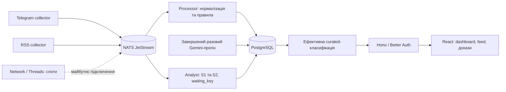

# Бриф для команди: продукт, докази та межі демо

Дата оновлення: **19.09.2026 UTC**. Повний нічний реліз із `main 6ba09d9` підтверджено **22:19:12 UTC**: WP2/WP3/WP4/WP8a/S2 та міграції 0012, 0014–0016, 0030–0031 розгорнуті. `analyst` healthy у стані **`waiting_key`**: runtime-ключ відсутній, новий модельний потік не ввімкнено; Telegram `llm_allowed` — **0 джерел**. **Повний I6 і серія з 80 браузерних знімків ще тривають; увесь нічний план не оголошено завершеним.** Поточне приймання ведеться у [STATUS.md](STATUS.md).

## 1. Що це

**Vodafone: AI Reputation & Crisis Intelligence** допомагає комунікаційній команді знайти тематичні повідомлення про оператора, перевірити цитати й оригінали та відрізнити сигнал від стороннього шуму. Працюють збір Telegram і RSS, збереження контексту, правила та окремі модельні результати. Головний дашборд і стрічка вже використовують актуальну семантичну розмітку завершеного разового прогону. Це раннє виявлення сигналів; точність відбору й здатність прогнозувати кризу не виміряні.

## 2. Що розгорнуто та які межі залишаються

| Можливість | Підтверджений стан для презентації |
|---|---|
| Telegram/RSS, «Увесь вхід», контекст, історія переглядів і реакцій, Sources, ролі | Працюють у production. Фактичні джерела, затримки й налаштування дивитися в застосунку; покриття не дорівнює всьому Telegram. |
| Разовий Telegram-аналіз Gemini/AGY | Завершений і доступний на `/analysis` для admin/analyst. Заморожений зріз, не безперервний аналіз нових надходжень. |
| Curated дашборд, стрічка та доступ за посиланням | Розгорнуті з 0020–0022. Метрики й переходи використовують ефективну класифікацію; нові/застарілі записи у семантичному workflow очікують аналізу. |
| «Vodafone: згадки за 7 днів», NEG-only, видимий cutoff і pending | Уже в curated-релізі. Це основний шлях до реальних Vodafone-доказів у демо. |
| WP2: позачерговий збір «Оновити зараз» і перебіг запиту | Розгорнуто. Перевірені дедуплікація, offline/deferred-стани та збереження FloodWait/Retry-After; натискання не гарантує нових даних одразу. |
| WP3: Network і Threads | UI-слоти й контракти розгорнуті. Регіони/вишки синтетичні, інтеграцію не підключено. Реальний Threads-збирач не працює. |
| WP4: калькулятор впливу в застосунку | Розгорнуто. Сценарна арифметика з джерелом і припущеннями; фактичних втрат не вимірює. Showcase залишається окремою ілюстрацією продукту. |
| WP8a: окремий `analyst`, S1 та runtime-провайдер | Сервіс розгорнуто, healthy у `waiting_key`. Модельні шляхи перевірено локальними HTTP mocks; реальних runtime-викликів без ключа немає. Telegram `llm_allowed` **не вмикався**. |
| S2: день/тиждень/місяць із доказами та fallback | Сервіс і UI/API розгорнуті; без ключа діє позначений шаблонний fallback. Доступність конкретного зведення залежить від чинних прав, версій входу, повноти агрегатів і ролі читача. |
| Атомарні місячні агрегати без читання текстів | 0030 розгорнуто: фізичні покоління, coverage та приховування неповного підсумку. Місячне читання dashboard/S2 не звертається до сирих текстів; час покоління видимий. |
| Додаткові security-виправлення | Розгорнуто 21:53 UTC: ізоляція кешу між сеансами/ролями, прив’язка shared-запитів до конкретного посилання та перевірки відкату релізу. Пройдено production smoke у двох темах на телефоні й комп’ютері. |

Реліз: images `ufv-api`, `ufv-pipeline`, `ufv-analyst` із тегом `night-20260919T221752Z`. Для відкату використовувати **лише manifest `/var/lib/ufv/releases/night-20260919T221752Z.json`**: його попередній API image містить bridge із атомарною перевіркою coverage. Старі manifests повертають API, несумісний із неповними фізичними агрегатами після 0030. Єдиний дозволений нічний restart collectors уже використано. Деталі — [контракт відкату](ROLLBACK_BRIDGE_REVIEW.md).

Повні контракти: [CURATED_DASHBOARD.md](CURATED_DASHBOARD.md), [ANALYSIS_ONCE.md](ANALYSIS_ONCE.md), [ANALYST.md](ANALYST.md), [PLAN_NIGHT.md](PLAN_NIGHT.md). Історичний тег `pitch-base-2026-09-19` не описує всі ці подальші зміни.

## 3. Сценарій демо на 3 хвилини

Перед показом перевірити доступ і потрібні матеріали. Не обіцяти рух лічильника в реальному часі: нове надходження, нове вимірювання й новий AI-результат — різні події.

1. **0:00 — [робочий дашборд](https://hire.qpon/).** Показати період, час зрізу, покриття й cutoff AI. Якщо за 24 години немає прийнятих матеріалів, пояснити це як результат доступного зрізу, без висновку про відсутність проблем у мережі.
2. **0:25 — «Vodafone: згадки за 7 днів».** Відкрити доказ від **17.09**: [Babel про фінансування мережі й 5G](https://t.me/babel/89794), mention `47170`; потім від **18.09**: [Vodafone про відновлення базових станцій](https://t.me/VFUkraine/1472), mention `28650`. Це повідомлення джерел; вони не доводять поточний стан усієї мережі. На контрольній перевірці обидва вже були поза rolling 24h.
3. **1:05 — «Контекст і доказ».** Показати збережений текст, дослівну цитату, дату публікації та оригінал. Пояснити, що зміна або видалення тексту/контексту робить стару модельну оцінку неактуальною. Якщо посилання чи запис більше недоступні, прямо сказати про це.
4. **1:35 — реакції та [операторський аналіз](https://hire.qpon/analysis).** Негативні emoji рахуються окремо від іронічних і сумних. На `/analysis` видно завершений разовий прогін і його межі; viewer цю сторінку не отримує.
5. **2:00 — явно позначена демонстрація в production.** Відкрити Network: регіон → вишка → деталі. Сказати: «Синтетичний сценарій; інтеграцію не підключено». Калькулятор: 1 година × 10% абонентів дає приблизно **343 тис. грн** за обраною формулою, а не підтверджені втрати. [Showcase](https://hire.qpon/showcase/) залишається окремою ілюстрацією, без твердження, що це живі дані.
6. **2:40 — наступний перевірний крок.** Попросити тестову телеметрію мережі, погоджений перелік джерел/підстав обробки та розмічену експертами вибірку для оцінки якості.

Слоти, refresh і S2 вже доступні в розгорнутому застосунку. Розрізняти робочу функцію, синтетичну демонстрацію та відсутнє зовнішнє підключення; наявність S2 без ключа не означає новий модельний аналіз.

## 4. Як обираються матеріали

Збирач зберігає нормалізований зміст із дозволеного налаштованого входу, URL, часові мітки, версію та агреговані метрики. Профілі авторів не є предметом аналізу; контакти маскуються. Правила, результати моделі та ручні рішення зберігаються окремо.

У workflow із завершеним AI-прогоном діє **загальна семантична брама**: відсутня або застаріла мітка означає `pending`, без повернення старого словникового шуму в основні метрики. `relevant` дає `accepted`, `review` лишається окремим операторським розглядом, решта відсіюється. Ручне рішення має пріоритет для тієї самої версії; тестові джерела з карантину прогону не стають реальними показниками через ручне прийняття. Workflow без завершеного прогону зберігає явно позначений режим правил.

Після розгорнутої інтеграції **0030** актуальна S1-мітка постійного `running`-прогону також бере участь у цій ефективній curated-класифікації: потрібні завершений receipt, правильна версія/model/prompt та чинні права джерела й контексту. Фізичне збереження правил окремо не означає, що S1 лише декоративна або не впливає на відбір. Розгорнута **0031** зберігає результати старого RSS-прогону зі scope `rss=allowed` без `source_ids`: тільки для RSS із чинним дозволом; цей виняток не поширюється на Telegram чи порожній scope.

Перевірка дослівної цитати підтверджує відповідність збереженому тексту, але не істинність повідомлення й не правильність модельного висновку. Перепублікація не є незалежним підтвердженням.

## 5. Реакції, актуальність і числа

Частка негативу — **NEG / усі реакції**: 👎 😡 🤬 🤮 💩 🤡. Іронічні 🤣 😁 😈 та сумні 😢 💔 😭 показуються окремо; решта не називається автоматично позитивною. Реакція на новину не обов'язково виражає ставлення до оператора. Перегляди не є кількістю унікальних людей, а коментарі не представляють усіх абонентів.

Кольорові пороги та рівні сигналів — демо-евристики з поясненою методикою. Вони не є оцінкою ймовірності кризи. Показувати час спостереження метрик: зафіксовані лічильники можуть бути старшими за час відкриття сторінки. FloodWait та інші обмеження джерел зберігаються. Періодичне оновлення UI не гарантує нового вимірювання чи виклику моделі.

Числа для слайдів — лише з датою й назвою зрізу:

- Telegram one-shot: cutoff **19.09.2026 20:07:46 UTC**, 44 753 невидалені записи, включно з коментарями; прогін завершений, 94 детальних аналізи. На **20:50:39 UTC** було 33 актуальні тематичні записи, з них 2 Vodafone. Це модельний результат, не виміряна точність. Нові чи змінені контексти можуть змінити актуальні лічильники.
- Післярелізна production-перевірка нічного пакета 19.09: **24h — 0, 7d — 33, 30d — 34; Vodafone за 7 днів — 2**. Джерела, конкуренти, переходи у стрічку й документи збігаються. Це контрольний знімок, не обіцянка поточних чисел. Під браузерним навантаженням API відповідав: місяць — 0,249 с, день — 3,779 с, тиждень — 10,333 с; це окремі вимірювання, не SLA.
- Старі **232 RSS / 230 поза темою** — окремий попередній зріз, не підсумок Telegram чи всього проєкту.
- Калькулятор спирається на показники I півріччя 2026, наведені в [джерелі фінансових припущень](https://interfax.com.ua/news/telecom/1196790.html): 14,9 млрд грн виручки та ARPU 154 грн/місяць. 14,9 млрд ÷ 4 344 години ≈ 3,43 млн грн/год; 1 000 абонентів × 154 × 12 ≈ 1,848 млн грн/рік. Пропорційність втрати виручки й збереження ARPU — припущення. $15 за людино-годину — орієнтир ментора, не виміряні витрати.

## 6. Архітектура й розвиток

Python-збирачі, processor і розгорнутий analyst мають окремі процеси й ролі БД. NATS/outbox підтримують повторну доставку з дедуплікацією. Telegram-секрети шифруються; ключ моделі не потрапляє в браузер. Інший збирач можна інтегрувати через подію й узгоджений формат, але це все одно потребує реалізації адаптера, перевірки прав і тестів. Самого контейнера для нового джерела недостатньо.

Після завершення поточного I6 наступні кроки — оцінити відбір на ручній вибірці, узгодити runtime-модель/ліміт і джерела, підключити тестову телеметрію та перевірити зв'язок сигналів із відомими інцидентами. Автоматичні інциденти, автономні рекомендації джерел, Threads/X та чат на живих даних не заявляються готовими цим пакетом.

## 7. Короткі відповіді для пітчу

| Запитання | Відповідь |
|---|---|
| AI уже аналізував Telegram? | Так, за прямим дорученням користувача завершено конкретний разовий зріз із коментарями. Це не дозвіл на постійну передачу нового Telegram-тексту: нічний `llm_allowed` для Telegram не вмикався. |
| Чому за добу нуль, а Vodafone є? | Дві перевірені публікації 17/18.09 вже були поза rolling 24h під час контрольного показу. Є явний перехід за 7 днів і видимий pending-вхід. |
| Чи працюватиме без ключа? | Розгорнутий analyst healthy у `waiting_key`, живе зі свіжим heartbeat, не викликає модель і використовує позначений fallback. У curated workflow відсутні нові мітки залишаються pending. Наявний завершений one-shot не зникає лише через відсутність runtime-ключа. |
| Чи безпечні посилання? | API обмежує роль/scope, строк і відкликання. Ізоляцію кешу та захист від підміни scope пізньою cookie розгорнуто й перевірено; повне приймання нічного релізу ще триває. |
| Чи дозволене використання матеріалів? | Підставу збору й передачі моделі фіксуємо окремо; публічність сама по собі не доводить дозвіл. Разовий Telegram-прогін мав явне доручення, а постійний gate лишається вимкненим. |
| Чи це точний прогноз або підтверджений збиток? | Ні. Це перевірні повідомлення й евристики; калькулятор показує наслідки введених припущень. |
