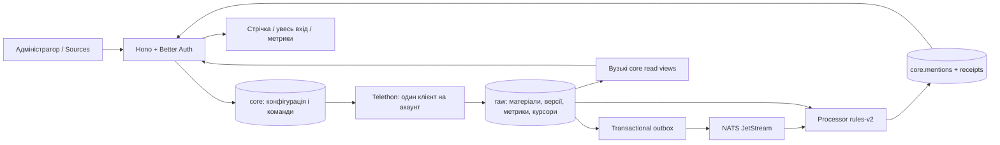

# Telegram: реалізований модуль і передавання команді

Стан гілки `feat/telegram-complete`, 2026-09-19. Інкремент розгорнуто 2026-09-19 о 19:17 UTC разом із RSS за прямою вказівкою користувача; див. [RSS.md](RSS.md). Точки інтеграції та базовий commit описані в [TELEGRAM_BRANCH.md](TELEGRAM_BRANCH.md).

## Що робить модуль

1. Адміністратор підключає акаунти у Sources → Telegram → Сесії. Збережено Better Auth, шифрування credentials, автоматичну реєстрацію після CLI-входу та ротацію ключів. Кожен активний акаунт має один Telethon-клієнт; весь collector захищено PostgreSQL advisory lock від другого екземпляра.
2. У вкладці «Джерела» додає публічний канал/супергрупу/форум або використовує «Масове додавання». Акаунти не шукають і не підписують джерела за ключовими словами самі. Для джерела потрібні обраний акаунт, workflow та підстава використання.
3. Bulk приймає до 200 @username чи t.me/telegram.me адрес, розділених рядками, комами або крапками з комою. Preview показує помилки й повтори. Перевірка доступу створює збережені resolve jobs; до списку джерел потрапляють лише успішно перевірені адреси після дії адміністратора.
4. «Вступити до доданих джерел» — окрема явна команда від обраного акаунта. Наявне членство не дублюється. Заявка на вступ, помилка, пауза, скасування і FloodWait видимі в UI. Модуль, акаунт і workflow мають бути ввімкнені. Вимкнений workflow не виконує навіть queued join.
5. Collector читає лише явно ввімкнені джерела: події наживо плюс історія з курсором. Пости каналів, comments і group_message зберігаються окремими типами. Вкладені відповіді посилаються на прямого батька; forum topic зберігається, коли Telegram його надав.
6. Нормалізація маскує контакти до запису. Processor формує accepted/review/rejected з поясненням і цитатою. Accepted → стрічка `/`; усі стани → `/inbox` для admin/analyst. Адміністратор може виправити рішення. Viewer і посилання не отримують весь вхід.
7. У матеріалі показуються знімки переглядів, пересилань, відповідей та агрегованих реакцій, час спостереження і стан стеження. Немає профілів авторів, списків реакторів або унікального «охоплення» з суми переглядів.

## Архітектура та володіння

API не запускає Telethon і не пише raw.items. Collector читає конфігурацію і пише raw; окремий виняток — оновлює стан `core.telegram_jobs`, які поставив API. Processor читає raw та записує свої core-результати. Нові grants є в міграціях і `deploy/bootstrap.py`, зокрема для встановлення з нуля, коли ролі створюються після міграцій.

## Схема і контракти

| Контракт | Зміст |
|---|---|
| `core.sources` + `raw.source_state` | Заданий акаунт/workflow, стабільний peer ID, поточний username, тип, курсор і час останнього успішного опитування |
| `raw.source_access` | Спостережений доступ окремого акаунта до peer; access_hash потрібен collector, API його не віддає |
| `raw.items` | Поточний очищений текст, `version`, `normalization_version`, `content_truncated`, peer/message ID, parent/thread/topic, часові мітки |
| `raw.item_versions` | Версії очищеного змісту; видалення повідомлення прибирає і старі тексти |
| `raw.metric_snapshots` | Незалежні часові знімки; nullable views/forwards/replies/reactions і availability |
| `raw.watch_state` | Стан, причина, наступна перевірка, lease, базовий snapshot, остання активність/помилка |
| `core.telegram_watch_policies/overrides` | Параметри workflow і ручне auto/pinned/paused для матеріалу |
| `core.telegram_imports/jobs` | Ідемпотентна пачка, resolve/join jobs, retries, lease, результати й cooldown |
| `core.incoming_items/telegram_metrics/telegram_watches/telegram_item_metadata` | Вузькі read models для API; прямого доступу API до raw.items немає |

Контракт `raw.item.created` v1 **не змінено**: тільки ID матеріалу, ID/тип джерела й fetched_at. Подія не містить тексту чи credentials. Consumer завантажує актуальну версію; повторна доставка безпечна. Зміни лише лічильників не створюють нову текстову версію або повторний аналіз. Міграція 0007 додає стеження для наявних постів і підвищує processor_revision для повторного аналізу правил.

HTTP під `/api/admin/telegram`, лише admin:

| Метод і маршрут | Дія |
|---|---|
| `POST /imports/preview` | `{input}` → рядки, розпізнані username, помилки |
| `POST /imports` | `{input,workflow_id,account_id,permission_note,enabled,idempotency_key}` → batch ID |
| `GET /imports`, `GET /imports/:id` | Пачки та jobs, без секретів |
| `POST /imports/:id/commit` | Додати успішно resolved джерела; звіт про вже наявні/інший workflow/акаунт |
| `POST /imports/:id/join` | Створити окремі join jobs для доданих джерел |
| `POST /jobs/:id/action` | `{action:pause|resume|cancel|retry}` за допустимим поточним станом |
| `GET/PUT /policies/:workflowId` | Прочитати/змінити всі перевірені числові параметри policy |
| `GET /watches?workflow_id=…` | До 200 записів стеження |
| `POST /watches/:itemId` | `{mode:auto|pinned|paused,reason}`; застосує collector |

До detail відповідей `/api/inbox/:rawId` і `/api/documents/:mentionId` додано `telegram: {metrics,watch,metadata}`. Перевірка прав і scope виконується **до** завантаження Telegram-detail. До 100 останніх метрик повертаються хронологічно. `has_duplicate` не розкриває координати іншого workflow. Shared summary не отримує detail; posts-only не отримує коментарі чи group_message.

## Надійність, дедуплікація і контекст

- `(source_id,peer:message)` унікальний. Транзакція і advisory lock серіалізують live/history; outbox записується разом із новою версією. Редагування лише регістру також створює версію. Старе спостереження не відновлює tombstone і не перезаписує новішу редакцію.
- Стабільний peer ID запобігає подвійним джерелам через різні адреси. Перед join перевіряється, що username досі означає той самий peer і акаунт не змінили. Збережений account-specific access_hash дає повторно знайти peer після перезапуску.
- Одна фізична Telegram-публікація, прочитана через пов'язані джерела, отримує canonical-позначку. Scoped записи залишаються розділеними. Рівний текст не доводить незалежності підтверджень.
- Processor використовує реальний ланцюжок відповідей до 8 предків, а не сусідні повідомлення групи. Collector може дочитати відсутніх предків групового повідомлення, також до 8. Невідомий батько → review; пізній батько/редагування інвалідує receipts дочірніх відповідей.
- Тексти Telegram не трактуються як HTML. Назви відомих корпоративних @згадок зберігаються як бренд до маскування. Реклама й неоднозначні згадки про шахрайство → review, а не автоматична криза. Потенційні хибні відсіви перевіряються у `/inbox`.
- Jobs мають lease/token і відновлюються після завершення строку lease; старий worker не перезаписує новий результат. Ідемпотентний ключ із іншим payload повертає 409. Повторні commit/join не дублюють джерела/команди.
- «Перевірити знову» для заявки на вступ перевіряє членство без повторного JoinChannelRequest. Ручне рішення щодо поста транзакційно підвищує ревізію workflow, щоб processor переглянув також залежні відповіді; стара редакція батька не використовується як актуальний контекст.
- FloodWait зберігає next_run_at і cooldown акаунта. Pause/resume не скорочує зафіксоване очікування; інший акаунт не використовується для обходу. Початковий інтервал між join — 20 секунд, **налаштування реалізації, не гарантований ліміт Telegram**.
- NATS тимчасово недоступний → outbox зберігається; processor має також catch-up із БД. Окремі RPC і обхід джерела мають timeout, щоб несправне джерело не тримало акаунт назавжди.

## Спостереження 2–24 дні

Це обрана реалізаційна інтерпретація запиту: lifecycle старого поста/гілки, **збір нових повідомлень джерела триває**. Усі значення нижче — редаговані стартові припущення.

| Стан | Коли | Інтервал за замовчуванням |
|---|---|---|
| active | Перші 2 дні, приріст активності, новий зміст/відповідь або pinned | 300 с |
| cooling | Кілька успішних порівнюваних перевірок без значного приросту | 3600 с |
| sleeping | Вік від 7 днів, щонайменше 3 тихі перевірки і доба без нової активності | 21600 с |
| archived | Вік від 24 днів і ті самі умови тиші; або вичерпаний строк із недоступними лічильниками | Планові перевірки припинено |
| blocked | Помилка перевірки/коментарів або недостатньо порівнюваних даних | Повтор; причина видима |
| paused/deleted | Ручна пауза/видалення у джерелі | Без перевірок |

Приріст рахується між порівнюваними спостереженнями за фактичним часом. Пороги на активний інтервал: 100 views / 1 reply / 5 reactions. Зменшення лічильника є корекцією, не «негативним ризиком». Помилка RPC не додає тихої перевірки. Архів через недоступні лічильники прямо пояснює, що активність невідома; це зупинка за строком, а не доказ тиші. Закріплення продовжує перевірки за строком. Нова отримана відповідь/редакція може відновити заархівовану гілку, але не долає ручну паузу.

Опитування коментарів пов'язане зі станом поста. Недоступна discussion group блокує висновок про тишу. У UI окремо наведено reported replies і кількість реально збережених коментарів/відповідей; вони можуть різнитися через доступ, пагінацію, видалення й тип джерела.

## Фактичні межі

- Telethon не дає необмеженого real-time доступу. Є права акаунта, FloodWait, заявки на вступ, downtime, затримка черги та історії. Polling workflow і UI refresh не є SLA від моменту події. Показуємо published_at/fetched_at/analyzed_at/observed_at/last_success_at; час появи в доступному Telegram API невідомий.
- Підтримуються публічні broadcast channels, supergroups і forums та доступні коментарі каналу. Приватні invitation links, особисті чати і basic groups не додаються. Forum topic — координата, не автоматично визначений інцидент.
- Один source належить одному workflow й одному призначеному акаунту; мульти-workflow через many-to-many не запроваджено, щоб зберегти наявну модель доступу. Dashboard links фільтрують джерела в межах workflow.
- Історія/коментарі добираються сторінками до 100; останні 10 повторно читаються для доступних правок. Повноту усіх старих редагувань/видалень під час offline не гарантовано. Реакції старих коментарів поза вікном повторного читання можуть бути застарілими. Окремий моніторинг усіх старих коментарів не реалізований.
- Архівована гілка не опитується: пізній коментар розбудить її, якщо він реально отриманий через updates; інакше потрібне ручне «Стежити далі». Це явний компроміс припинення polling.
- До 65 536 символів очищеного тексту; перевищення позначається `content_truncated`, не приховується. OCR/аудіо/медіа без підпису не аналізуються. Маскування контактів не є безпомилковим розпізнаванням усіх персональних згадок у тексті.
- **LLM, sentiment/claims, об'єднання в інциденти й AI-бриф тут не реалізовані.** Чинний аналіз — rules-v2. Класифікатор і lifecycle не обіцяють прогнозу чи виміряної точності. Для AI потрібні окремо підтверджені права на обробку Telegram-контенту та обраний провайдер; credentials Telethon моделі не передаються. Повний продуктовий план залишається у [TELEGRAM_NEXT.md](TELEGRAM_NEXT.md).

## Як перевірити й передати агенту аналізу

`npm ci && npm run build` перевіряє TS і збирає API/web. Інтеграційні тести: `UFV_TEST_ENV=/protected/test-env.json python -m pytest tests -q`; вказувати **тільки окрему ufv_checks**. Файл містить DATABASE_URL власника, SERVER_DATABASE_URL API-ролі, COLLECTOR_DATABASE_URL, PROCESSOR_DATABASE_URL, PUBLIC_URL, ADMIN_PASSWORD тестового admin@ufv.test, TG_SESSION_KEY, NATS_URL та ізольовані UFV_NATS_STREAM/UFV_NATS_SUBJECT. Налаштування має бути 0600 поза Git; міграції, Better Auth, grants і тестовий адміністратор мають бути підготовлені. Тести скидають fixture-таблиці та rate limits лише в цій БД.

`UFV_TEST_ENV=/protected/test-env.json python scripts/check_telegram_browser.py` після тестів запускає Chromium з окремим профілем. Синтетичні матеріали явно позначені; screenshots у ignored `artifacts/telegram-browser`. Реальні Telegram-акаунти не залучаються до автоматичних тестів.

Агент аналізу може споживати чинний `raw.item.created` і читати актуальні item/version/context. Метрики мають окремий час і не є сигналом зміни змісту. Фактичні claims мають посилатися на item/version/span; цитати потрібно перевіряти в тій самій очищеній версії, URL брати зі сховища. Аналізи/інциденти слід додавати новими таблицями/міграціями, не переписувати raw і не вигадувати відсутні факти.
