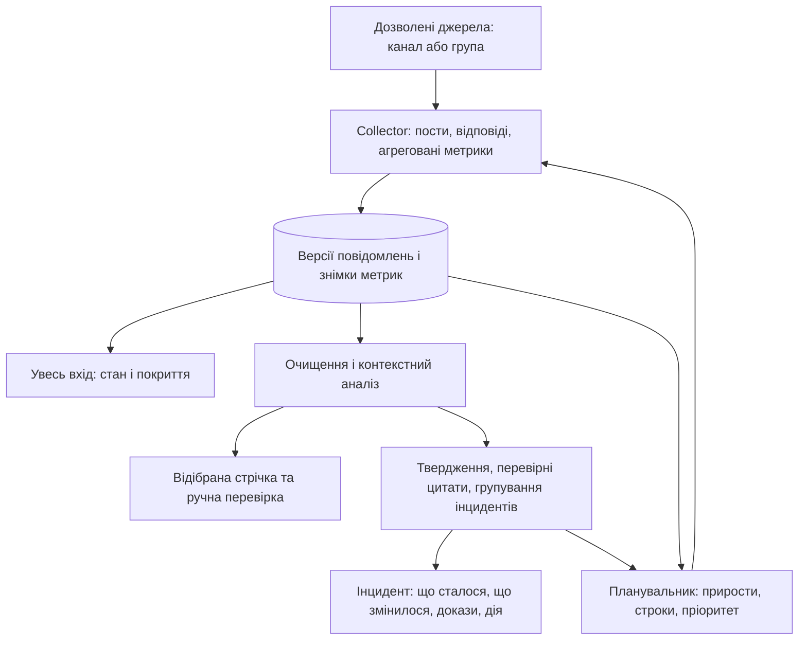

# Telegram: аудит і наступний план

Оновлено 2026-09-19. Це **пропозиція наступного інкременту**, не опис уже реалізованих функцій. Підстава — запит користувача про bulk-add/join, модель даних, очищення, релевантність, коментарі/реакції, стеження протягом 2–24 днів і корисну аналітику. Під час цього аудиту код застосунку та конфігурація збору не змінювалися.

Стек залишається чинним: React/TypeScript, Hono/Better Auth, PostgreSQL, NATS, Python/Telethon. Межі поточної реалізації — [ARCHITECTURE.md](ARCHITECTURE.md); поточний стан — [STATUS.md](STATUS.md).

## Що працює і що відсутнє

| Частина | Перевірений стан | Наступна задача |
| --- | --- | --- |
| Сесії | Telegram 1 online, credentials зашифровані; Telegram 2 ще не авторизований | Проста діагностика станів і друге підключення за потреби |
| Джерела | Одиночне додавання публічного каналу з призначеним акаунтом | Тип джерела, bulk-import, попередня перевірка, стабільна ідентичність |
| Групи | Окрема супергрупа #1 відхиляється з PublicBroadcastRequired | Публічні супергрупи й відповіді як окремий тип; форуми виділити окремо |
| Живий збір | Джерело #2 watching; отримано 1 пост, rules-v1 відсіяв його як нетематичний | Перевірити тематичний пост, обговорення, редагування та перезапуск |
| Коментарі | Є discussion mapping, прямий батько, курсори, повторне дочитування | Live acceptance, пізні коментарі, недоступні/видалені обговорення, масштабування обходу |
| Перегляди/реакції | raw.items.metrics зарезервовано, collector його не заповнює | Знімки агрегатів у часі, окрема подія про метрики |
| Очищення | Unicode/контакти/посилання, прості правила спаму | Збереження змісту, версії нормалізації, ознака обрізання, контроль персональних даних |
| Релевантність | Ключові слова + обмежений контекст коротких відповідей | Контекстна оцінка й структуровані твердження; ручна вибірка якості |
| Стеження | Фіксований polling, старі обговорення обходяться по черзі | Пріоритет, next_check_at, сон/архів, квоти та захист нових повідомлень від черги історії |
| Dashboard | Увесь вхід, відібрана стрічка, фільтри, review, scoped links | Динаміка, інциденти, перевірні докази, бриф і рішення оператора |
| LLM/інциденти | Немає робочої реалізації | Окремий аналіз із перевіркою доказів і дозволеності обробки |

Цей один пост підтверджує доставку через поточний pipeline, а не якість фільтра або покриття коментарів. На момент перевірки гілок обговорень у БД не було. Текст поста не передавався в модель у межах цього аудиту.

## Межі джерел та bulk-операції

Розрізняти три незалежні дії: додати джерело в конфігурацію, вступити в канал акаунтом, увімкнути його збір. Припинення перевірки старого поста не має відписувати акаунт або вимикати отримання нових постів каналу.

Потік bulk-add: список @username/t.me-посилань або CSV → нормалізація вводу → визначення типу та peer ID → попередня таблиця → призначення акаунта/workflow → додавання. Кожен рядок показує: канал/супергрупа/непідтримуване, уже додано, доступний, потрібен вступ, немає доступу, помилка. Повторення списку не створює дублікати. Не завантажувати довільні URL із CSV сервером: приймати тільки відомі формати Telegram.

Bulk-join — окрема явно обрана дія адміністратора для перевіреного списку. Це збережені завдання, а не паралельний виклик для всього списку. Стани: queued, running, already_joined, joined, approval_pending, flood_wait, failed, cancelled. Перед виконанням перевіряти, чи завдання ще дозволене; після рестарту звіряти фактичне членство, не дублювати вступ. Пауза/продовження/скасування доступні в Sources. Join не означає автоматичного дозволу на аналіз контенту.

Ліміти акаунта і FloodWait обов'язкові; універсальної гарантованої норми «N вступів за хвилину» не вводити. Не перекидати завдання на інші акаунти для обходу обмеження. Автовступ за довільною пропозицією LLM у цьому інкременті не робити. Telegram має окремі помилки переповнення підписок, заявки на вступ і недоступності: [joinChannel](https://core.telegram.org/method/channels.joinChannel), [Telethon RPC errors](https://docs.telethon.dev/en/stable/concepts/errors.html).

## Модель даних

Запроваджувати новими міграціями; старі raw ID, посилання, review і доступи зберігати. Не створювати паралельну другу БД.

| Сутність | Мінімальний зміст і відповідальність |
| --- | --- |
| core.sources | platform, stable peer_id, source_type, current username/title, linked discussion peer, конфігурація доступу; API володіє бажаними налаштуваннями |
| core.workflow_sources | Зв'язок джерела з workflow, enabled, правила фільтра, обсяг історії; дозволяє один збір для кількох представлень |
| raw.source_access | source/account, спостережений тип доступу/членство, checked_at, last_error; пише collector |
| core.source_assignments | Один активний збирач-акаунт на джерело, desired state/revision; API призначає, collector виконує |
| raw.items + raw.item_versions | Фізичне повідомлення за (platform, peer_id, message_id), post/comment/group_message; очищений текст, версія, parent/thread/topic, час, ознаки недоступності/видалення/обрізання; collector |
| raw.threads | channel post ↔ discussion root, окремі parent/thread зв'язки, comment cursor, стан доступності; collector |
| raw.metric_snapshots | item_id, observed_at, views, forwards, reported replies, reaction counts by type, availability; агрегати без авторів/реакторів; collector |
| core.analyses + core.claims | Версії матеріалу/контексту/моделі/схеми, рішення й причина, тема/бренд/тип матеріалу, твердження, цитати та їхні межі; processor |
| core.watch_targets + watch_decisions | Пост/гілка, стан, next_check_at, last_activity_at, останні успішні знімки, policy version, причина переходу, ручний pin; scheduler |
| core.incidents + incident_evidence | Подія, статус, час/місце, окремі твердження; докази support/contradict/update/recovery, походження та сімейство перепублікацій; processor та ручний review |
| core.briefs | Версійований бриф, набір evidence ID, час, статус перевірки й актуальності; processor |
| jobs + job_attempts | Тип, target ID, account, idempotency key, стан, next_run_at, lease_until, спроби/помилки; API створює дозволені команди, worker виконує |

Цільова ідентичність — peer ID джерела, а не username: назва може змінитися. Username залишається адресою/alias. Повідомлення discussion group, отримане як коментар каналу й як допис підключеної групи, зберігати один раз і зв'язувати з обома представленнями. Автопересилання поста в discussion group — transport mirror, не незалежний доказ. IDs авторів не додавати.

Міграція до workflow_sources вимагає перенести поточний sources.workflow_id, зберегти сумісність API і звузити контекст за правами workflow. Не робити її прихованим побічним ефектом bulk-import. Якщо часу мало — тимчасово залишити один workflow на джерело й явно назвати обмеження.

Історія версій зберігає тільки дозволений очищений текст. Видалення/відкликання права поширюється також на старі версії, цитати, пошукові індекси, брифи та майбутні кеші/вектори. Tombstone можна зберігати без змісту. Період зберігання контенту задається окремо від частоти спостереження.

## Нормалізація та релевантність

1. Збирати мінімальні поля за allowlist. Не серіалізувати весь Telethon Message: у ньому можуть бути автори, пересилачі й списки людей.
2. Чистити Unicode/форматування, маскувати контактні та персональні дані до запису. Не губити заперечення, часові уточнення, місто, числа й назву оператора. Відомі корпоративні згадки можна відображати як назву бренду до маскування; невідомі @handles не зберігати. Автоматичне маскування довільних імен не вважати безпомилковим.
3. Зберігати normalization_version, content_version, content_truncated. Довгий текст ділити на блоки з покриттям усіх частин; поточні 16 000 символів не обрізати мовчки.
4. Розділити topic relevance, матеріал-спам, рекламний характер і репутаційну важливість. Реклама тарифу може бути корисна для конкурентного аналізу. Згадка казино в новині не обов'язково є спамом. Реклама/спам за замовчуванням не створюють кризу, але рішення можна переглянути.
5. Аналізувати коментар із кореневим постом і прямим батьком; за потреби додати обмежений ланцюжок предків. Коментар із власною проблемою може бути релевантний навіть під нетематичним постом. Не успадковувати негатив автоматично від усієї гілки.
6. За дозволеності AI передавати моделі очищений контекст і вимагати структуру: decision, reason, brands, topics, content_type, claims[]. У claim — проблема, місце/час або unknown, тональність щодо конкретного об'єкта, reported/confirmed/denied/resolved, evidence item/version/span.
7. Backend перевіряє JSON, цитати, версії й передані ID. Не приймати URL від моделі: їх формує API з джерел. Не називати заявлену причину збою встановленою без доказів. Некоректна відповідь/timeout → review і збережена повторна спроба; матеріал залишається у вході.
8. Пост/коментар — недовірені дані. Модель не виконує інструкції з їхнього тексту, не отримує Telegram credentials і не може самостійно підписувати акаунти, змінювати права чи публікувати відповіді.

Результат надає факти та аргументацію, а не вигадану «точність 97%». Перед масовим відсіюванням потрібна ручна вибірка, що включає також rejected: інакше не видно пропущених корисних повідомлень.

## Коментарі, реакції та метрики

Коментарі каналу є гілкою повідомлення в пов'язаній discussion group; окрема група має інший шлях збору. Потрібні прямий parent, root, channel post, курсор, статус доступу та час останньої успішної перевірки. Старий пост із пізнім коментарем має залишатися доступним для планувальника. [Discussion groups](https://core.telegram.org/api/discussion), [message threads](https://core.telegram.org/api/threads).

У Telegram є опціональні views/forwards/replies/reactions; перегляди не доступні однаково для каналів і груп. Недоступне поле зберігати null з причиною, а не 0. reported reply count і число реально отриманих коментарів — різні показники; показувати обидва й покриття. Нуль текстових відповідей після помилки доступу не означає відсутності дискусії. [Message schema](https://core.telegram.org/constructor/message).

Реакції зберігати тільки агрегатами за типом. Не збирати recent_reactions, top_reactors, recent_repliers або списки людей через getMessageReactionsList. Emoji сам по собі не доводить тональність щодо Vodafone. [MessageReactions](https://core.telegram.org/constructor/messageReactions).

Лічильники спостерігати окремо від версії тексту. У запиті метрик getMessagesViews використовувати increment=false для опитування лічильника, не збільшувати його штучно кожною перевіркою; це не скасовує окремих вимог Telegram до поведінки клієнта. [getMessagesViews](https://core.telegram.org/method/messages.getMessagesViews).

Знімки мають власні observed_at. Δviews/Δreplies/Δreactions рахуються між порівнюваними успішними спостереженнями й діляться на фактичний Δt. Зменшення лічильника зберігати як корекцію/видалення, не як негативну швидкість кризи. Зміна реакцій — чиста різниця агрегатів, не кількість нових людей. Сума переглядів постів не є унікальним охопленням.

## Механізм продовження стеження

Питання користувачеві: 2–24 дні стосуються поста чи всього каналу? Поки **припущення** — старого поста/гілки. Нові пости ввімкненого джерела продовжують надходити незалежно від стану старих. Автоматичну паузу всього каналу не вмикати мовчки; окрема рекомендація може спиратися на частку корисних матеріалів, витрати й ручні виправлення.

Модель оцінює зміст: важливість проблеми, нову фактичну інформацію, зв'язок з інцидентом, неоднозначність. Код оцінює зміну метрик, строк і ресурси та фіксує перевірне рішення. Для арифметики й кожного polling модель не потрібна. На даних, для яких AI недозволений, lifecycle працює за звичайними правилами й ручним пріоритетом.

Перший прозорий критерій активності: є новий релевантний коментар/твердження, зміна фактів, активний інцидент або приріст метрики перевищує і мінімальний абсолютний поріг, і поріг швидкості для цього джерела/віку поста. Пороги задаються окремо для метрик у конфігурації; їхні значення ще не виміряні. Відносний приріст із майже нуля сам по собі не достатній. Якщо історії для baseline немає, показати це й застосувати позначене припущення, а не називати результат статистичною аномалією.

Не трактувати великий переглядовий приріст як кризу без змістових ознак. Важливий доказ без популярності теж повинен лишатися в роботі. Негативні коментарі до одного вірусного поста не є множиною незалежних підтверджень збою.

Стартовий профіль нижче — **непогоджені тестові налаштування**, не SLA і не виміряні оптимальні інтервали:

| Стан | Коли | Перевірки старого поста/гілки |
| --- | --- | --- |
| active | Перші 2 дні або є змістова/метрична активність | Метрики приблизно раз на 5 хв; нові повідомлення через push + окреме catch-up |
| cooling | Старший 2 днів, щонайменше 3 успішні перевірки без значущої активності; без pin/активного інциденту | Приблизно раз на годину |
| sleeping | Старший 7 днів, не було активності останню добу й немає винятків | Приблизно раз на 6 годин, щоб мати шанс помітити повернення уваги |
| archived | Старший 24 днів, немає pin або активного інциденту | Планове опитування зупинене; дані позначені часом останнього спостереження |

Будь-який значущий сигнал у cooling/sleeping повертає active. Після повного archive неможливо виявити новий приріст без спостереження: відновлення лише вручну, за новим пов'язаним доказом/подією, яку реально отримали, або через окремо ввімкнену рідку перевірку архіву. Не обіцяти автоматичне «пробудження» без такого каналу сигналу.

Недоступність, FloodWait, збій worker, неповне дочитування чи один знімок — це unknown/blocked, не тиша. Вони не просувають quiet streak. Історичний імпорт старого поста починається з початкової оцінки; час fetched_at не робить стару публікацію новою. Pin людини та активний інцидент можуть подовжувати строк, із видимою ціною/причиною. Архівація спостереження не видаляє докази й сама не закриває інцидент.

## Завдання, події та інтеграція

Чинний NATS залишити для доставки подій. Заплановані перевірки і bulk-команди зберігати в PostgreSQL: claim через lease/блокування, дедуплікація за target/type/version, retries із backoff, відновлення після падіння. Найближчі джерела/живі події мають окремий бюджет від backfill і старих гілок. Старі джерела не повинні голодувати через постійно активний канал. Кількість одночасних RPC та витрати LLM обмежені конфігурацією.

Схеми подій розширити версійовано в packages/contracts. Не ламати поточний raw.item.created v1. Нові типи: item.changed, metrics.observed, analysis.completed, incident.changed. Поля: event_id, schema_version, entity_id, entity_version або snapshot_id, occurred_at. Повний текст і credentials не передаються в NATS.

Контент змінився → аналіз нової версії та залежного контексту. Змінилися лише перегляди → перерахунок динаміки/розкладу, без повторної оплати LLM за той самий текст. Нові коментарі → аналіз нових повідомлень і оновлення висновку гілки з контрольованим бюджетом контексту. Відновлення processor читає невиконані jobs/receipts із БД. Помилки зовнішньої моделі не зупиняють collector і `/inbox`.

Майбутні API-контракти: `POST /api/admin/source-imports/preview`, `POST /api/admin/source-imports`, `GET /api/admin/source-imports/:id`, `POST /api/admin/source-imports/:id/join`; `GET /api/documents/:id/metrics`, `GET /api/incidents`, `GET /api/incidents/:id`, `POST /api/admin/watch-targets/:id/override`. Збереження користувацьких рішень — через API й audit; credentials модель ніколи не бачить. Для bulk POST потрібен idempotency key; GET повертає результат кожного рядка, без секретів.

## Від змісту до корисного dashboard

Інцидент — окрема сутність. Кандидатів відбирає код за брендом, проблемою, часом і географією; аналіз порівнює лише цей набір і може залишити матеріал неприв'язаним. Одна публікація може дати кілька тверджень; заперечення/відновлення не повинні рахуватися як ще одна скарга. Спільний ключ «Vodafone + інтернет» недостатній для об'єднання різних міст/подій. Сімейства перепублікацій зберігати окремо від повідомлень: показувати розповсюдження та незалежність доказів різними числами, невідому незалежність не вигадувати.

Чотири робочі представлення: Sources (доступ і свіжість), Увесь вхід (усе отримане), Стрічка (релевантне з причиною), Інциденти (що потребує рішення). Метрики відображаються поруч із часом знімка та динамікою за обраний інтервал. Не виводити порожні дані як нуль або якість підключення як якість аналізу.

Картка інциденту: короткий опис; статус і пріоритет із причинами; бренд/проблема/географія; хронологія; підтвердження, заперечення, відновлення; нові змістові повідомлення та окремо метрики уваги; кількість матеріалів/сімейств походження; остання перевірка, прогалини й причини watch-state; наступна рекомендована дія. Кожне фактичне речення брифу посилається на evidence ID/цитату/версію/оригінальне джерело. Числа обчислює backend. Пропозиція звернутися до технічної команди позначається рекомендацією, а не встановленою причиною проблеми.

Бізнес-роль для запропонованого сценарію — комунікаційний менеджер: відкриває новий сигнал → звіряє цитати й незалежність → перевіряє наявність спростування → призначає відповідального/наступну перевірку → отримує короткий бриф. Роль ще не є відповіддю користувача на питання про фінальний пітч.

Адмін зберігає керування джерелами/ключами/доступами. До зміни shared permissions ручні рішення залишаються admin-only. Передавання analyst права виправляти інциденти потребує окремого контракту прав і перевірок. Viewer і share не отримують відсіяне, секрети чи докази з іншого workflow. Генерувати доступний бриф зі scope-дозволених доказів: не показувати глобальний бриф, якщо він містить висновки із закритих матеріалів.

## Межа використання LLM

Актуальні [API Terms](https://core.telegram.org/api/terms) і [Content Licensing](https://telegram.org/tos/content-licensing), перевірені 2026-09-19, обмежують використання Telegram-даних для AI/ML, включно з deployment; це не лише тренування. Умови описують можливі винятки за конкретною індивідуальною згодою всіх відповідних користувачів. Публічність або один дозвіл адміністратора каналу не означають автоматичного права на LLM-аналіз усіх коментарів; локальна модель цього питання не усуває.

Тому в запропонованій архітектурі є окремий контроль допустимості збору, показу та AI-обробки за матеріалом/контекстом, з підставою й строком. Простий checkbox адміністратора сам не створює права. Поки підстава для AI не встановлена, модель не отримує ні текст, ні його агрегати як обхід обмеження. Наявний дозволений режим правил/ручної роботи зберігається. Для AI-демо можна окремо обрати матеріали з чітким дозволом на такий аналіз, зокрема придатні джерела поза Telegram. Конкретні права ще потрібно встановити.

## Порядок виконання і критерії

1. **P0 — завершити один реальний шлях.** Канал + дозволена супергрупа з відповідями, явний тип джерела, діагностика; пост/коментар/редагування → raw → рішення → UI. Критерій: отримане звірене з Telegram, чужих авторських даних немає, помилки не приховані.
2. **P1 — керований збір.** Bulk-preview/add, окрема черга join, доступи акаунтів, snapshots, watch states і ресурсний бюджет. Критерій: повторний імпорт/перезапуск без дублів, FloodWait витримано, відсутня метрика не є нулем, нові пости не блокуються старими гілками.
3. **P2 — зміст і докази.** Схема аналізу, contextual relevance, review, один тип інцидентів і перевірний бриф на дозволених даних. Критерій: кожен факт має дійсну цитату, помилкову прив'язку можна виправити, бриф перебудовується після видалення доказу.
4. **P3 — показ цінності.** Стрічка/інцидент/докази/динаміка й сценарій менеджера; ручна вибірка accepted і rejected, вимір затримок по етапах, резервне історичне демо з позначкою replay.

Для 1–2 днів обсяг залежить від реальних навичок і дедлайну. Мінімальний завершений результат: P0 + snapshots + прості watch states + одна картка інциденту. Bulk-join з повним UI, forum topics, складний baseline, векторний пошук і широке автономне discovery не повинні витіснити цей шлях. Розширення виконувати послідовними вертикальними інтеграціями, а не обіцяти весь перелік як готовий за день.

Робочі пакети для 7 людей (імена ще невідомі): інтегратор/контракти; collector каналів/груп/коментарів; bulk/jobs/метрики/scheduler; нормалізація/класифікація/якість; інциденти/докази/API; dashboard; реальні джерела/перевірка/пітч. Спочатку узгодити item/snapshot/analysis контракти, потім один item провести до браузера; після цього додавати динаміку й інциденти.

Обов'язкові сценарії перевірки: alias одного джерела й повторний bulk; група проти каналу; вкладений/пізній коментар; перезапуск під час catch-up; редагування/видалення; зміна тільки реакцій без нового LLM; unknown counters; поганий JSON/вигадана цитата; reply з власною проблемою під нетематичним постом; перехід sleeping → active і межі archive; ручний pin; недоступна модель; обмежені viewer/share, включно з брифом. Lifecycle на 24 дні перевіряти керованим тестовим часом, не видавати це за 24 дні реальних спостережень.

Відкриті рішення: точний сенс 2–24 днів; права на конкретні матеріали для AI; LLM-провайдер і бюджет; пороги/квоти після вибірки; retention; правила forum topics; основна роль й часовий ресурс команди. Жодне з них не позначене погодженим мовчки.
